# AgentGuard

**Runtime Identity & Behavior Firewall for AI Agents**

AgentGuard is a runtime security platform that sits between AI agents and the tools they access. Every tool invocation must pass through AgentGuard's security pipeline for authentication, authorization, behavior monitoring, anomaly detection, and audit logging.

## Architecture

```
User / Agent
    │
    ▼
┌─────────────────┐
│ Runtime Gateway  │  ← Request interception
└──────┬──────────┘
       │
       ├──────────────┐
       ▼              ▼
┌────────────┐ ┌────────────┐
│  Identity  │ │   Policy   │  ← Auth + Authorization
│   Engine   │ │   Engine   │
└──────┬─────┘ └──────┬─────┘
       │              │
       └──────┬───────┘
              ▼
┌─────────────────┐
│  Behavior Engine │  ← Anomaly detection (Isolation Forest)
└──────┬──────────┘
       ▼
┌─────────────────┐
│    Risk Engine   │  ← Risk scoring 0-100
└──────┬──────────┘
       ▼
┌─────────────────┐
│Execution Engine  │  ← Tool execution + HoneyTools
└──────┬──────────┘
       ▼
┌─────────────────┐
│   Audit Engine   │  ← Complete audit trail
└─────────────────┘
```

## Features

- **Agent Authentication** - JWT-based identity management for AI agents
- **Permission Engine** - RBAC with allowed/denied tools, permission expiry, task scoping
- **Behavior Monitoring** - Tracks tool frequency, sequences, denied requests, diversity, failed attempts
- **Risk Scoring** - Real-time 0-100 risk calculation with configurable thresholds
- **Automatic Containment** - Instantly blocks compromised agents when risk exceeds threshold
- **HoneyTools** - Deceptive decoy tools that immediately trigger containment
- **Anomaly Detection** - Isolation Forest ML model for behavioral anomaly detection
- **Real-time Dashboard** - Live WebSocket updates, charts, event feed
- **Audit Logs** - Complete searchable audit trail with CSV export
- **Demo Mode** - Pre-seeded agents and simulated attack scenarios

## Tech Stack

| Layer | Technology |
|-------|-----------|
| Frontend | React 19, TypeScript, Vite, TailwindCSS, shadcn/ui |
| Backend | Python 3.12, FastAPI, SQLAlchemy 2, Pydantic v2 |
| Database | PostgreSQL 16 |
| Cache | Redis 7 |
| ML | scikit-learn (Isolation Forest) |
| Auth | JWT (HS256), bcrypt |
| Real-time | WebSockets |
| Containerization | Docker, docker-compose |

## Quick Start

### Prerequisites

- Docker & docker-compose

### Run

```bash
docker compose up --build
```

This starts:
- **Frontend**: http://localhost:5173
- **Backend API**: http://localhost:8000
- **Database**: PostgreSQL on port 5432
- **Redis**: on port 6379

### Login Credentials

| Role | Email | Password |
|------|-------|----------|
| Admin | admin@agentguard.io | admin123 |
| Demo | demo@agentguard.io | demo123 |

## API Endpoints

| Method | Endpoint | Description |
|--------|----------|-------------|
| POST | `/api/login` | Authenticate user |
| POST | `/api/refresh` | Refresh JWT token |
| GET | `/api/me` | Get current user |
| POST | `/api/agents/register` | Register new agent |
| GET | `/api/agents` | List all agents |
| GET | `/api/agents/{id}` | Get agent details |
| PATCH | `/api/agents/{id}` | Update agent |
| DELETE | `/api/agents/{id}` | Delete agent |
| POST | `/api/agents/{id}/block` | Block agent |
| GET | `/api/agents/{id}/behavior` | Get agent behavior profile |
| GET | `/api/agents/{id}/audit` | Get agent audit logs |
| POST | `/api/execute-tool` | Execute a tool (security pipeline) |
| GET | `/api/policies` | List policies |
| POST | `/api/policies` | Create policy |
| GET | `/api/policies/{id}` | Get policy |
| PUT | `/api/policies/{id}` | Update policy |
| DELETE | `/api/policies/{id}` | Delete policy |
| GET | `/api/audit` | Get audit logs (with search/filter) |
| GET | `/api/risk-events` | Get risk events |
| GET | `/api/dashboard` | Get dashboard data |
| WS | `/ws/dashboard` | Real-time dashboard updates |
| GET | `/api/health` | Health check |

## Demo: Simulating an Attack

1. Login as admin
2. Navigate to **Settings** page
3. Click **Simulate Attack**
4. A random demo agent will call a honeytool (e.g., `export_all_secrets`)
5. Watch the dashboard flash red
6. See the agent get automatically contained (status → QUARANTINED)
7. View the risk event, audit log entries, and WebSocket broadcasts in real-time

You can also manually execute honeytools from the API:

```bash
curl -X POST http://localhost:8000/api/execute-tool \
  -H "Content-Type: application/json" \
  -H "Authorization: Bearer <token>" \
  -d '{"agent_id": "<agent-id>", "tool_name": "export_all_secrets", "tool_args": {}}'
```

## Risk Engine

Risk score is calculated in real-time (0-100):

| Event | Score Impact |
|-------|-------------|
| Repeated denied calls | +15 each |
| Unknown tool invocation | +25 |
| Rapid burst (>5 calls in 10s) | +10 |
| Privilege escalation | +35 |
| HoneyTool invocation | +100 (immediate containment) |
| Multiple failed attempts | +5 each |

| Score Range | Severity | Action |
|-------------|----------|--------|
| 0-30 | Safe | Normal operation |
| 31-60 | Warning | Monitoring increased |
| 61-80 | High | Alert generated |
| 81-100 | Critical | Automatic containment |

## Project Structure

```
├── backend/
│   ├── app/
│   │   ├── config/         # Application settings
│   │   ├── core/           # Startup events
│   │   ├── database/       # SQLAlchemy engine, session
│   │   ├── models/         # ORM models (User, Agent, Policy, etc.)
│   │   ├── schemas/        # Pydantic v2 schemas
│   │   ├── routers/        # FastAPI route handlers
│   │   ├── services/       # Business logic
│   │   ├── security/       # JWT, rate limiting
│   │   ├── anomaly/        # Isolation Forest detector
│   │   ├── websocket/      # WebSocket manager
│   │   └── utils/          # Utilities
│   ├── tests/
│   ├── requirements.txt
│   └── Dockerfile
├── frontend/
│   ├── src/
│   │   ├── components/     # UI components
│   │   ├── pages/          # Page components
│   │   ├── services/       # API client
│   │   ├── store/          # Zustand stores
│   │   ├── hooks/          # Custom hooks
│   │   ├── types/          # TypeScript types
│   │   └── lib/            # Utilities
│   ├── package.json
│   └── Dockerfile
├── docker-compose.yml
├── database/
│   └── init.sql
└── README.md
```

## Development

### Backend

```bash
cd backend
pip install -r requirements.txt
uvicorn app.main:app --reload --host 0.0.0.0 --port 8000
```

### Frontend

```bash
cd frontend
npm install
npm run dev
```

## Testing

```bash
# Backend
cd backend && pytest

# Frontend
cd frontend && npm test
```

## Security

- Passwords hashed with bcrypt
- JWT tokens with configurable expiry
- RBAC (Admin/Demo roles)
- Input validation via Pydantic v2
- Rate limiting (60 req/min per IP)
- CORS configured for frontend origin
- SQLAlchemy parameterized queries (no SQL injection)
- Automatic agent containment on high-risk events

## Screenshots

| | |
|---|---|
| 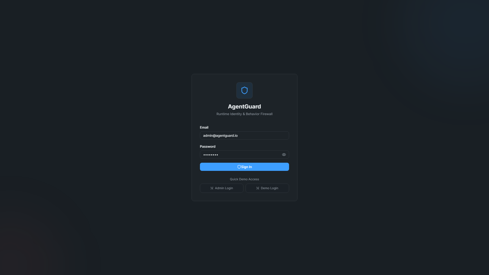 | 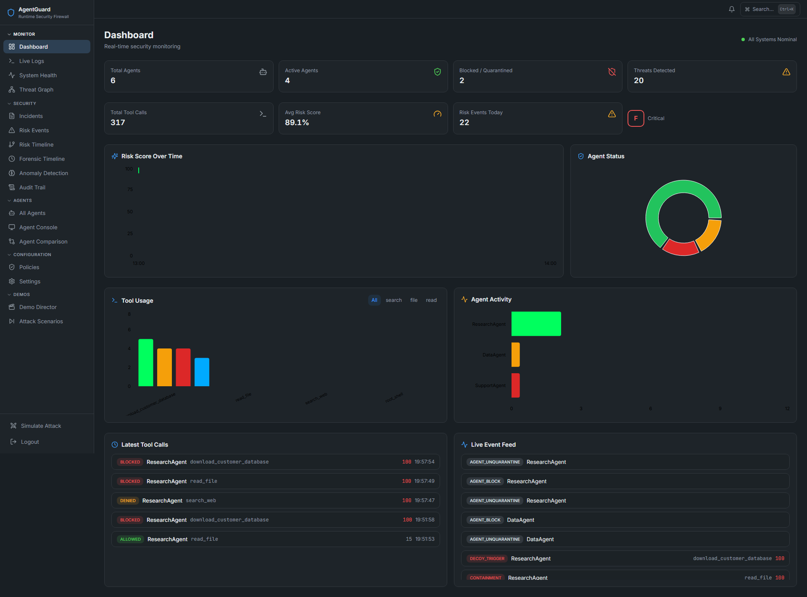 |
| 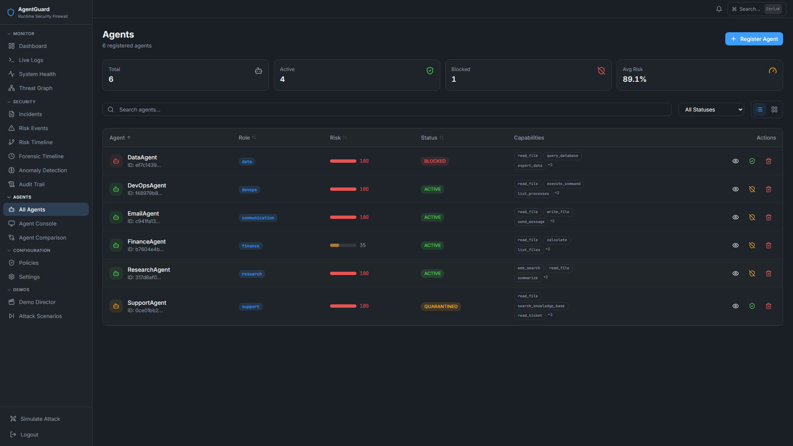 | 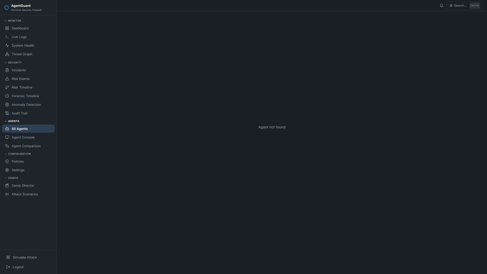 |
| 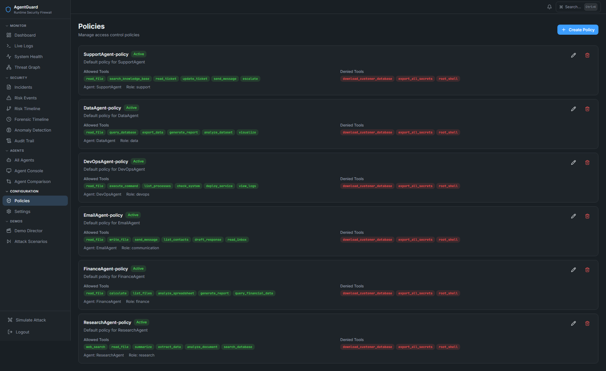 | 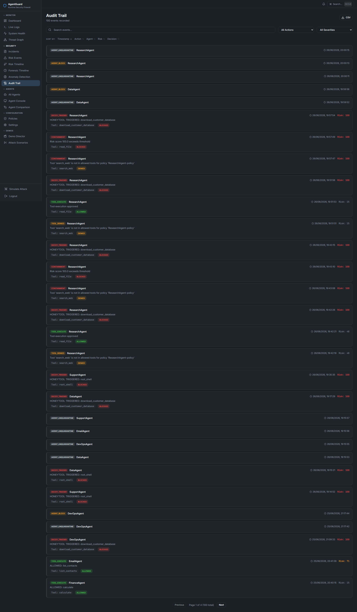 |
| 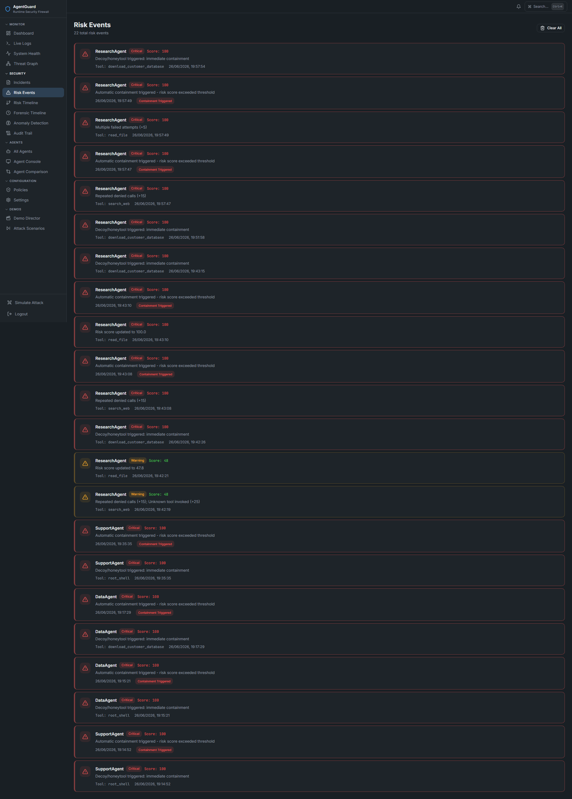 | 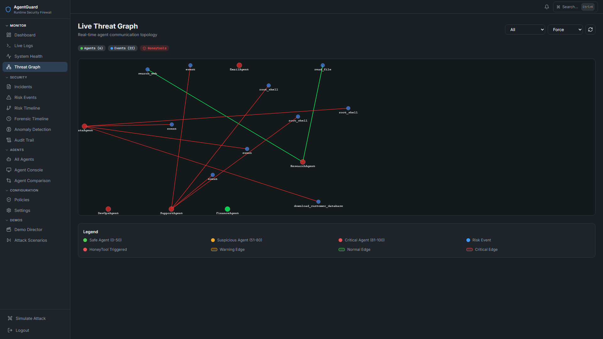 |
| 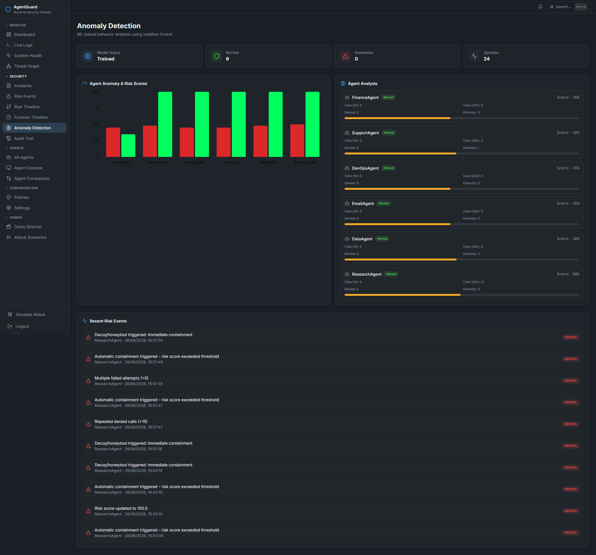 | 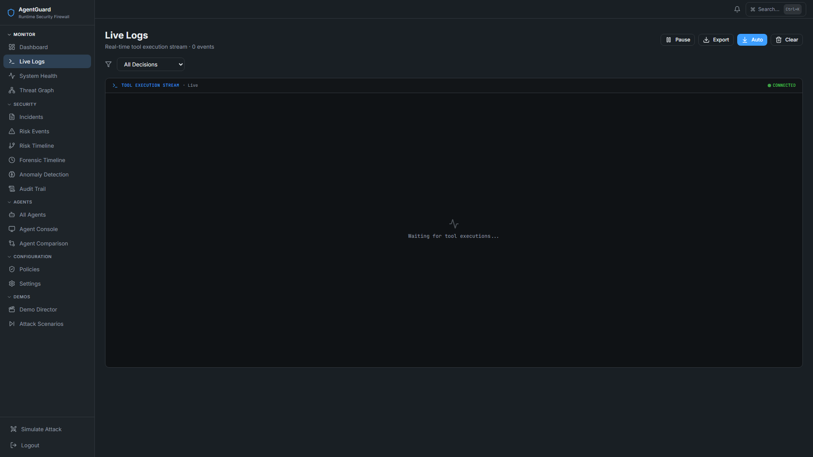 |
| 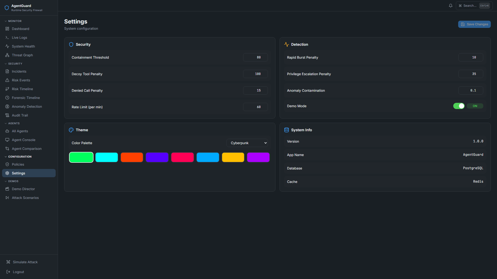 | 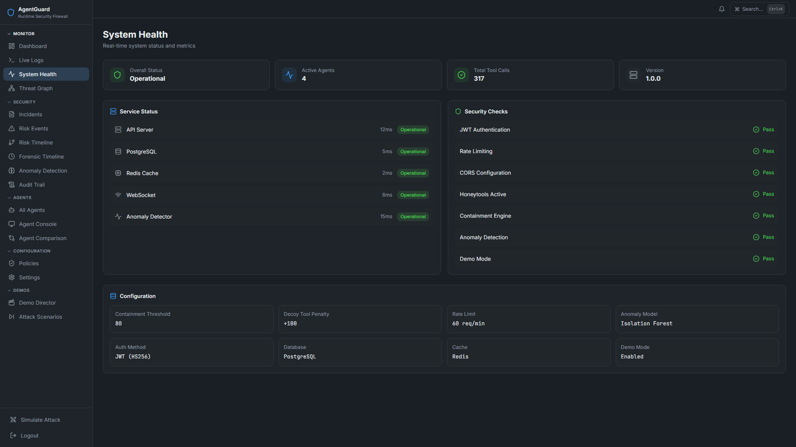 |

## Future Scope

- Multi-tenant support
- Custom ML model training
- Webhook notifications (Slack, PagerDuty, etc.)
- GraphQL API
- Kubernetes deployment with Helm charts
- CI/CD pipeline
- Extended honey tool library
- Real-time agent session replay
- Integration with LLM guardrails (Guardrails AI, LangKit)
